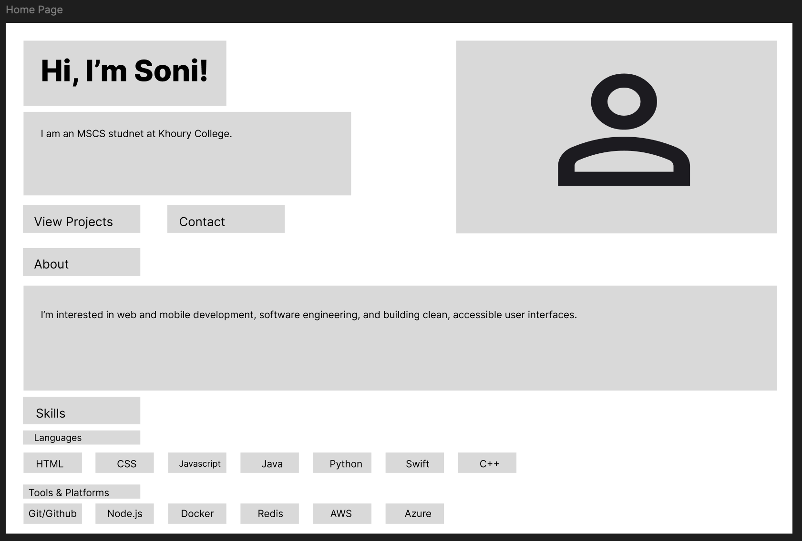
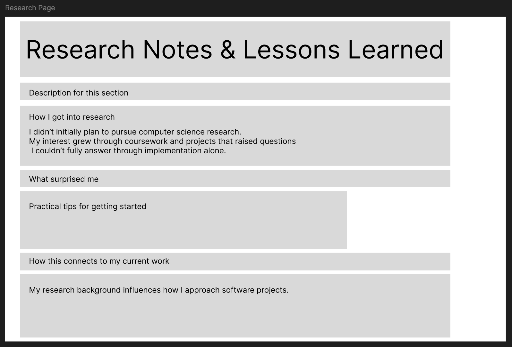
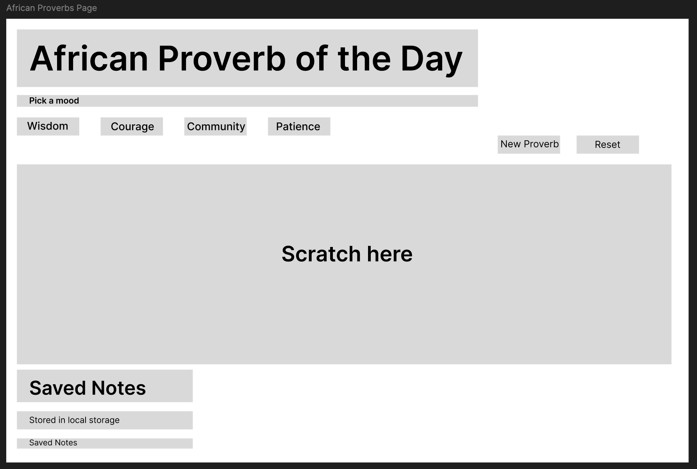

# Design Document — Project 1 (CS 5610)
Author: Soni Rusagara  
Date: January 30, 2026  

## 1) Project Description
This project is a front-end–only personal homepage built with vanilla HTML5, CSS3, and ES6 modules.
It introduces who I am, highlights my skills and projects, and provides contact links. The site is responsive
and accessible, and it includes a small creative/interactive component to differentiate it from a basic template.

### Goals
- Present a clear homepage with meaningful information
- Provide navigation to additional pages (Projects + AI Page)
- Keep the code organized (html/css/js/img folders) and standards-compliant
- Build an interactive feature using vanilla JS (no libraries)

## 2) User Personas
### Persona A: Recruiter / Hiring Manager
- **Name:** Jordan
- **Goals:** Quickly understand who I am, what I can do, and see projects
- **Needs:** Simple navigation, scannable sections, working links, fast load
- **Pain points:** Overly busy pages, broken links, unclear project info

### Persona B: Class TA / Instructor
- **Name:** Alex
- **Goals:** Check rubric requirements efficiently
- **Needs:** Clear folder structure, semantic HTML, validation, README, AI disclosure page
- **Pain points:** Missing meta tags, placeholder text, broken paths, lint/format issues

## 3) User Stories
- As a **recruiter**, I want to see a short intro and key skills so I can decide quickly if the student fits a role.
- As a **recruiter**, I want to open project pages and repo links so I can evaluate work quality.
- As a **visitor on mobile**, I want the layout to adapt to my screen so the site is readable without zooming.
- As a **TA**, I want to verify the AI disclosure page exists so the rubric requirement is met.
- As a **TA**, I want the site to validate with W3C and have alt text so accessibility standards are followed.
- As a **user**, I want contact links (email/GitHub/LinkedIn) so I can reach the author easily.
- As a **visitor**, I want the navigation to be consistent across pages so I don’t get lost.

## 4) Design Mockups
Include images of your planned layout. 
- Figma screenshots
### Mockup: Home Page

### Mockup: Projects Page

### Mockup: Research Notes Page

### Mockup: African Proverbs Scratch Page

